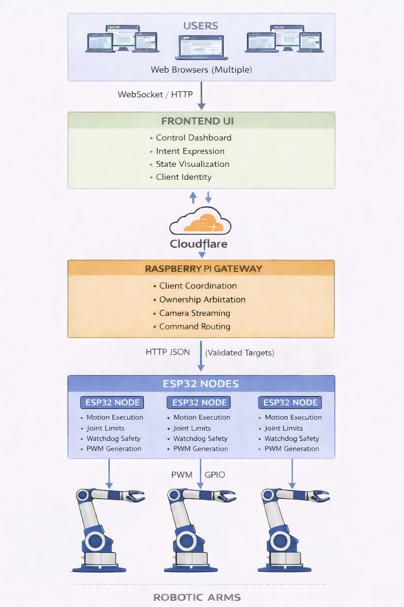

# System Architecture

**End-to-End Design and Control Ideology — EDCS-RA**

---

## 1. Architectural Objective

EDCS-RA (Edge-Assisted Distributed Control System for Robotic Arms) is engineered to enable **remote, multi-user, multi-arm robotic control** without compromising safety, determinism, or fault isolation.

The architecture deliberately decomposes the system into distinct responsibility layers—**intent expression, coordination, and physical execution**—ensuring that complexity and failure at higher layers never propagate downward into actuator control.

This is not an optimization choice.
It is a **non-negotiable safety boundary**.

---

## 2. Core Design Philosophy

EDCS-RA is built on three non-overlapping principles.

**Control authority is always local to hardware.**
No networked service, UI, or gateway process is trusted to directly manipulate actuators. All mechanical constraints, timing guarantees, and fail-safe behavior are enforced exclusively within ESP32 firmware.

**Coordination is centralized, but intentionally thin.**
The system allows multi-user and multi-arm interaction through a gateway layer that performs ownership arbitration and routing—without embedding motion logic or actuator awareness.

**User interfaces are disposable by design.**
The frontend is treated as an interchangeable intent surface. It may evolve, be replaced, or fail entirely without affecting system safety or execution integrity.

---

## 3. High-Level System Topology

EDCS-RA follows a strictly layered, neighbor-only communication model:

Each layer communicates **only with its immediate neighbors**.
There are no shortcuts, backdoors, or cross-layer authority leaks.

---

## 4. User Layer

Users interact with EDCS-RA exclusively through a browser-based interface.

They:

* observe system state,
* request control ownership,
* and issue high-level motion intent.

Users never connect to ESP32 devices directly, never see hardware endpoints, and never influence actuator behavior without passing through arbitration and validation layers. This abstraction is deliberate and enforced.

---

## 5. Frontend Layer — Intent Expression Surface

The frontend represents the **human–system boundary**.

Its role is strictly limited to:

* capturing user intent,
* visualizing arm state and availability,
* maintaining session identity,
* and relaying requests to the gateway.

The frontend performs **no actuation logic**, **no safety enforcement**, and **no authoritative state management**. All interactions are speculative until acknowledged by the gateway.

Connectivity loss or UI failure does not place the system into an unsafe state.

---

## 6. Gateway Layer — Coordination and Arbitration

The Raspberry Pi gateway functions as the **coordination nucleus** of EDCS-RA.

It is responsible for:

* managing concurrent client connections,
* arbitrating exclusive arm ownership,
* routing validated commands,
* aggregating camera streams,
* and enforcing liveness via heartbeat signals.

Critically, the gateway does **not** generate PWM signals, compute motion profiles, or enforce mechanical limits. It treats each ESP32 node as an authoritative executor, not a peripheral.

---

## 7. Ownership and Concurrency Model

EDCS-RA enforces **explicit, exclusive ownership**.

At any moment:

* one robotic arm may be controlled by only one client,
* ownership transitions are explicit and acknowledged,
* conflicting commands are structurally impossible.

This model eliminates race conditions, undefined motion, and multi-user interference. Ownership is decided centrally at the gateway and propagated downward with session context.

---

## 8. ESP32 Layer — Execution and Safety Authority

Each ESP32 node is a **self-contained execution controller** bound to exactly one robotic arm.

It is the *only* layer permitted to:

* generate PWM signals,
* attach or detach servos,
* enforce joint limits,
* manage motion timing,
* and execute emergency shutdowns.

ESP32 nodes operate safely even in isolation. If communication is interrupted or commands become stale, the firmware autonomously transitions the arm into a safe state.

---

## 9. Safety Enforcement Strategy

Safety in EDCS-RA is **local-first and non-delegable**.

Mechanical limits, watchdog timers, and actuator detachment logic reside at the firmware layer—not in the cloud, gateway, or UI. Higher layers may request stops or resets, but the ESP32 firmware is the final execution authority.

No upstream failure can force unsafe motion downstream.

---

## 10. Communication Contracts

Inter-layer communication is intentionally minimal and explicit.

* **Frontend ↔ Gateway**: WebSocket messages for intent, state updates, and ownership events.
* **Gateway ↔ ESP32**: HTTP JSON messages containing validated targets and heartbeat signals.

No layer relies on implicit state. Messages are designed to be idempotent where possible.

---

## 11. Scalability Model

EDCS-RA scales horizontally by design.

* Adding users does not affect firmware behavior.
* Adding robotic arms requires only additional ESP32 nodes.
* Gateway complexity grows linearly with system size.

This makes the architecture suitable for labs, classrooms, and distributed robotics environments.

---

## 12. Failure Isolation

Failures are intentionally compartmentalized.

* Frontend failure affects only the connected client.
* Gateway restarts do not compromise actuator safety.
* ESP32 faults are isolated to individual arms.

There is no single software failure mode that can induce uncontrolled system-wide motion.

---

## 13. Network and Latency Considerations

Latency-sensitive operations are strictly local.

PWM generation and motion stepping occur on ESP32 hardware. Network delays impact responsiveness, not safety. Heartbeat mechanisms at multiple layers detect stale connections and trigger safe fallbacks.

---

## 14. Extensibility and Future Evolution

The architecture explicitly accommodates:

* inverse kinematics services,
* AI-based planners,
* simulation layers,
* and alternative frontends.

All such extensions integrate at the gateway layer, preserving firmware simplicity and safety guarantees.

---

## 15. Architectural Summary

EDCS-RA enforces a **downward flow of authority**:

* Users express intent
* Frontend visualizes and forwards intent
* Gateway coordinates and arbitrates
* ESP32 firmware executes safely
* Hardware responds deterministically

This separation is not an implementation artifact.
It *is* the system’s ideology.

---

## Closing Statement

EDCS-RA is not optimized for convenience.
It is optimized for **control integrity**, **fault isolation**, and **long-term maintainability**.

In this system, authority is earned layer by layer — and safety is never outsourced upward.

---

* compress this into a **paper-style abstract**, or
* derive a **one-page architecture slide** for demos and reviews
